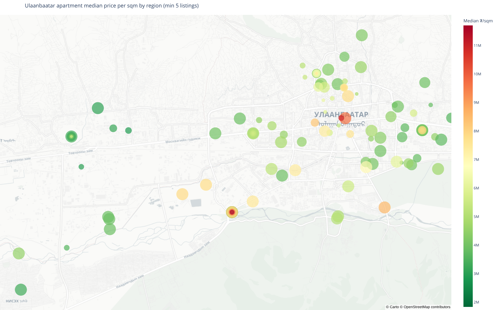
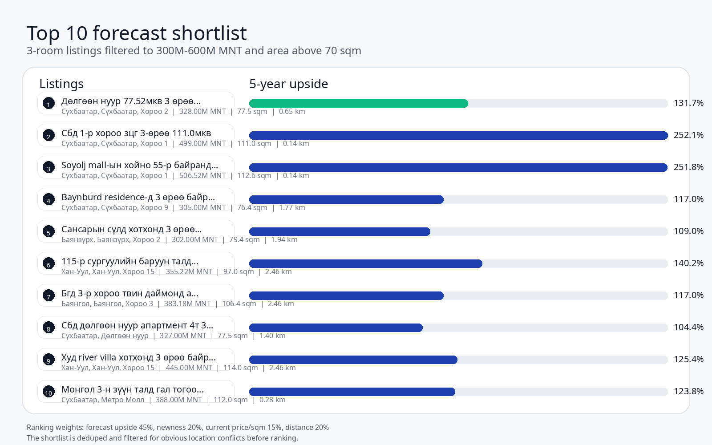

# Unegui UB Apartment Analysis

This repository scrapes public Unegui.mn apartment listings for Ulaanbaatar, normalizes the listing data, computes price and location statistics, builds a 5-year nominal MNT forecast, and exports a shareable top-10 shortlist with real listing photos and maps.

The project is built for reproducible analysis rather than one-off spreadsheets. The checked-in files are the scripts and documentation. Generated CSV, XLSX, HTML, ZIP, PDF, and download folders are intentionally excluded from version control.

All commands below assume the `base` conda environment is active.

## Snapshot

### Ulaanbaatar price map


The cover map is exported from the real Plotly HTML map output and is fit to the data extent so it only shows the regions with listings.

### Forecast shortlist


## What This Project Does

1. Scrapes Unegui listing pages and, when requested, individual detail pages.
2. Parses price, room count, size, listing date, location, and listing links.
3. Computes apartment statistics by district, region, room count, and property type.
4. Builds a forecasting model using local Unegui medians plus official 1212 tables.
5. Ranks listings using forecast upside, newness, current price per sqm, and distance to Sukhbaatar Square.
6. Exports a shareable top-10 HTML report with actual listing photos, a map overview, and one map per listing.

## Repository Layout

- `scraper.py` - crawl Unegui listing pages, optionally fetch detail pages, and create basic analysis CSVs.
- `listing_statistics.py` - build region and district statistics plus the price-per-sqm heatmap and median map.
- `rank_listings.py` - clean, deduplicate, and rank listings by price/sqm, distance, and room count.
- `forecast_listings.py` - build the 5-year nominal MNT forecast and final ranked shortlist.
- `export_top10_details.py` - download listing photos and render the top-10 HTML report with maps and full details.
- `build_readme_assets.py` - build the PNG figures used on the README front page.
- `make_share_package.py` - legacy bundle builder for earlier shareable outputs.
- `Stats/` - local 1212 tables used by the forecast step. Not tracked in git.
- `share_results*/`, `top10_*report/`, and the generated CSV/XLSX/ZIP/PDF files - build outputs. Not tracked in git.

## Current Analysis Rules

The current full-scrape ranking workflow uses these filters:

- 3-room apartments only.
- Total asking price between 300,000,000 MNT and 600,000,000 MNT.
- Total area strictly greater than 70 sqm.
- Rows with obvious title/location district conflicts are excluded from ranking.
- Near-duplicate listings with the same location, size, room count, and very similar asking prices are collapsed to one representative.

Forecast assumptions:

- New means built in 2021 or later.
- Fair value per sqm is a 50/50 blend of local Unegui medians and official 1212 district averages.
- The forecast is a 5-year nominal MNT projection.

Current ranking weights:

- Forecast upside: 45%
- Building newness: 20%
- Current MNT per sqm: 15%
- Distance to Sukhbaatar Square: 20%

## Key Outputs

The current full-scrape workflow produces these main files:

- `unegui_ub_all_pages_details.csv` - raw full scrape of Unegui listing pages.
- `unegui_ub_all_stats_apartment_price_per_sqm_heatmap.html` - heatmap based on actual listing-level price per sqm values.
- `unegui_ub_all_stats_apartment_price_per_sqm_map.html` - median price-per-sqm map by region.
- `unegui_ub_all_3room_filtered_forecast_all.csv` - all rows with forecast fields and exclusion notes.
- `unegui_ub_all_3room_filtered_forecast_ranked_apartments.csv` - deduped ranked list.
- `unegui_ub_all_3room_filtered_forecast_top10.csv` - final top 10 shortlist.
- `Unegui_UB_all_3room_filtered_Forecast_Listings.xlsx` - shareable workbook.
- `top10_forecast_all_3room_filtered_report/top10_listings_report.html` - HTML report with photos, details, overview map, and one map per listing.
- `Unegui_UB_all_3room_filtered_forecast_results_package.zip` - bundled share package.

## Reproducible Workflow

### 1. Activate `base` and install dependencies

```bash
conda activate base
python -m pip install -r requirements.txt
```

### 2. Scrape all pages

Use `--all-pages` to discover pagination automatically. Add `--details` to fetch the listing detail pages, which is required for the richer analysis outputs.

```bash
python scraper.py --all-pages --details --workers 12 --output unegui_ub_all_pages_details.csv --analyze --analysis-prefix unegui_ub_all
```

### 3. Build statistics and maps

```bash
python listing_statistics.py --input unegui_ub_all_pages_details.csv --output-prefix unegui_ub_all_stats
```

This produces the region and district statistics, room counts, property-type breakdowns, the apartment price-per-sqm heatmap, and the median price-per-sqm map.

### 4. Build the forecast ranking

Place the required 1212 tables in `Stats/` first. The forecast step expects the annual HPI table and the district price table used by `forecast_listings.py`.

```bash
python forecast_listings.py --input unegui_ub_all_pages_details.csv --stats-dir Stats --output-prefix unegui_ub_all_3room_filtered
```

### 5. Export the top-10 report

```bash
python export_top10_details.py --input unegui_ub_all_3room_filtered_forecast_ranked_apartments.csv --output-dir top10_forecast_all_3room_filtered_report --top-n 10 --workers 8
```

The HTML report includes:

- actual listing photos downloaded from the listing page,
- the parsed listing details,
- one overview map of the top 10,
- one individual map for each listing,
- links back to the original Unegui pages.

### 6. Build the README figures

```bash
python build_readme_assets.py --map-html unegui_ub_all_stats_apartment_price_per_sqm_map.html
```

If Chrome is not already available to Kaleido in your `base` environment, pass `--chrome-path /path/to/chrome` so the map cover is rendered from the HTML export instead of falling back to the schematic version.

This writes:

- `assets/ub_median_price_map.png`
- `assets/ub_top10_forecast.png`

## Data Notes

- `price_per_sqm` is always derived from the asking price and area of the listing.
- `asking_to_fair_pct` is `(asking price / estimated fair value) - 1`. Negative values mean the asking price is below the model estimate.
- The heatmap uses actual listing-level price-per-sqm values, not district medians.
- The median map uses median price per sqm by region or district.
- Some coordinates are inferred from area or district lookups when exact listing coordinates are not available.
- The forecast is a ranking tool, not a formal appraisal.

## Requirements

- Python 3.10 or newer.
- `pandas`
- `requests`
- `beautifulsoup4`
- `plotly`
- `kaleido`
- `Pillow`

Install them with:

```bash
python3 -m pip install -r requirements.txt
```
